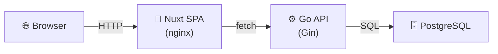

# Arkitektur

## Översikt

```
┌─────────────┐     ┌─────────────┐     ┌─────────────┐
│   Browser   │────▶│  Nuxt SPA   │────▶│   Go API    │
│             │◀────│             │◀────│             │
└─────────────┘     └─────────────┘     └──────┬──────┘
                                                │
                                                ▼
                                        ┌─────────────┐
                                        │  PostgreSQL │
                                        └─────────────┘
```

## Stack

| Lager        | Teknologi    | Docker Image        | Port | Syfte                     |
| ------------ | ------------ | ------------------- | ---- | ------------------------- |
| **Frontend** | Nuxt 3 (SPA) | `nginx:alpine`      | 80   | Interface, statiska filer |
| **API**      | Go + Gin     | `gcr.io/distroless` | 8080 | REST API, affärslogik     |
| **CLI**      | Go          | Lokal binär         | -    | Utvecklingsverktyg       |
| **Databas**  | PostgreSQL   | (extern)            | 5432 | Data-lagring              |

## Kataloger

```
src/
├── nuxt/              # Frontend (Nuxt SPA)
│   ├── app/           # Vue-komponenter, pages, routing
│   ├── nuxt.config.ts # SPA-konfiguration
│   └── Dockerfile     # Multi-stage: dev + nginx-prod
│
└── go/                # Backend (Go API)
    ├── cmd/
    │   ├── api/       # REST API entry point
    │   └── cli/       # CLI + TUI (counter-demo)
    ├── internal/      # Intern logik (counter)
    ├── go.mod         # Go dependencies
    └── Dockerfile     # Multi-stage: distroless runtime
```

## Kommunikation

### Frontend → API

```typescript
// Använder runtimeConfig
const config = useRuntimeConfig();
const data = await fetch(`${config.public.apiBase}/endpoint`);
```

### API → PostgreSQL

```go
// Standard database/sql med pq-drivrutin
db, _ := sql.Open("postgres", os.Getenv("DATABASE_URL"))
```

## Miljövariabler

| Variabel               | Nuxt | Go  | Beskrivning                  |
| ---------------------- | ---- | --- | ---------------------------- |
| `DATABASE_URL`         | -    | ✅  | PostgreSQL connection string |
| `NUXT_PUBLIC_API_BASE` | ✅   | -   | URL till Go API              |
| `PORT`                 | -    | ✅  | API port (default: 8080)     |

## Kör lokalt

### Go API

```bash
# Kör direkt med go run
cd src/go && go run ./cmd/api

# Eller bygg och kör
cd src/go && go build -o api ./cmd/api && ./api
```

### Go CLI (lokalt kompilerad)

CLI-verktyg kompileras lokalt (ej i Docker):

```bash
# Kompilera CLI
cd src/go && go build -o cli ./cmd/cli

# Kör CLI
./cli tui    # Interaktiv TUI
./cli get    # Visa räknare
./cli inc    # Öka
./cli dec    # Minska
./cli reset  # Återställ
```

### Nuxt dev server

```bash
cd src/nuxt && bun run dev
```

### PostgreSQL (om lokal)

```bash
docker run -d -p 5432:5432 -e POSTGRES_PASSWORD=secret postgres:16
```

### Docker

```bash
# Bygg och kör Go API
cd src/go && docker build -t repo-api . && docker run -p 8080:8080 repo-api

# Bygg och kör Nuxt SPA
cd src/nuxt && docker build -t repo-spa . && docker run -p 3000:80 repo-spa
```

### Med docker-compose (framtida)

```yaml
services:
  api:
    build: src/go
    ports:
      - "8080:8080"
    environment:
      - DATABASE_URL=postgres://user:pass@db:5432/mydb

  spa:
    build: src/nuxt
    ports:
      - "3000:80"
    environment:
      - NUXT_PUBLIC_API_BASE=http://api:8080

  db:
    image: postgres:16
```

## Mermaid ER-diagram (databas)

```mermaid
erDiagram
    %% Lägg till tabeller här när databas-schema skapas
```

## Mermaid Arkitektur-diagram



## Beslut

| Beslut                    | Motivering                                                                |
| ------------------------- | ------------------------------------------------------------------------- |
| **Nuxt SPA (ej SSR)**     | SEO oviktigt, enklare arkitektur, mindre image, enklare att byta frontend |
| **Go API**                | Snabb, enkel distribution, bra för REST, all affärslogik här              |
| **CLI lokalt kompilerad** | Enklare än Docker, inget extra image, snabb iteration                    |
| **Separerade containers** | Skalas oberoende, ren separation, frontend-backend oberoende              |
| **nginx för SPA**         | Minimal image (63MB), bra för statiska filer                              |
| **distroless för Go**     | Minimal image (17MB), säkert                                              |

### Varför SPA?

- **Enklare byta frontend** - Nuxt/Vue kan bytas ut mot React/Svelte utan att ändra API
- **Backend logik i Go** - All affärslogik, databashantering och API-endpoints är i Go
- **Löst kopplade komponenter** - Frontend och backend utvecklas och deployas separat
- **Mindre Docker-image** - nginx:alpine (63MB) istället för Node-runtime (280MB)

## Utökning

### Lägga till en ny tabell

1. Lägg till schema i `src/go/internal/db/migrations/`
2. Skapa model + repository i `src/go/internal/`
3. Lägg till route i `src/go/cmd/api/main.go`
4. Uppdatera ER-diagram i denna fil

### Lägga till en ny sida

1. Skapa `.vue`-fil i `src/nuxt/app/pages/`
2. Lägg till i `src/nuxt/app/app.vue` navigation
3. Automatisk routing via file-based routing
