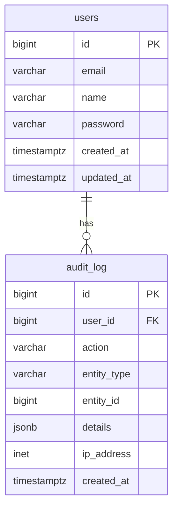
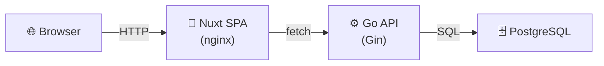

# Arkitektur

## Översikt

```
┌─────────────┐     ┌─────────────┐     ┌─────────────┐
│   Browser   │────▶│  Nuxt SPA   │────▶│   Go API    │
│             │◀────│             │◀────│             │
└─────────────┘     └─────────────┘     └──────┬──────┘
                                                │
                                                ▼
                                        ┌─────────────┐
                                        │  PostgreSQL │
                                        └─────────────┘
```

## Stack

| Lager        | Teknologi    | Docker Image        | Port | Syfte                     |
| ------------ | ------------ | ------------------- | ---- | ------------------------- |
| **Frontend** | Nuxt 3 (SPA) | `nginx:alpine`      | 80   | Interface, statiska filer |
| **API**      | Go + Gin     | `gcr.io/distroless` | 8080 | REST API, affärslogik     |
| **CLI**      | Go           | Lokal binär         | -    | Utvecklingsverktyg        |
| **Databas**  | PostgreSQL   | CNPG                | 5432 | Data-lagring (Kubernetes) |
| **Schema**   | Atlas        | Operator            | -    | Schema-migration (K8s)    |

## Kommunikation

### Arkitektur

Nuxt och Go API kommunicerar via nginx proxy för att undvika CORS och hårdkodade portar:

```
┌─────────────────────────────────────────────────────────────┐
│                     Kubernetes Cluster                       │
│                                                             │
│   ┌─────────────┐       ┌─────────────┐       ┌─────────┐  │
│   │  Nuxt SPA   │──────▶│   nginx    │──────▶│ Go API  │  │
│   │  (nginx)   │ /api/ │   proxy    │       │  :8080  │  │
│   └─────────────┘       └─────────────┘       └─────────┘  │
│         │                     │                     │       │
│         │                     │                     │       │
│         ▼                     ▼                     ▼       │
│   Browser hämta         proxy /api/           Go binary   │
│   statiska filer       till :8080             /health     │
└─────────────────────────────────────────────────────────────┘
```

### Varför nginx proxy?

| Problem | Lösning |
|---------|--------|
| CORS vid cross-origin | Alla anrop är same-origin via nginx |
| Hårdkodade portar | Relative URLs (`/api/health`) |
| Olika portar i dev vs prod | Samma kod, nginx sköter routing |

### Implementation

**Nuxt** - använder relativ URL:
```typescript
const response = await fetch('/api/health')
```

**nginx** - proxy config i Dockerfile:
```nginx
location /api/ {
    proxy_pass http://go-api-service:8080/;
}
```

**Resultat:**
- `localhost:9998/api/health` → nginx → `go-api-service:8080/health`
- Ingen CORS behövs
- Inga hårdkodade portar

## API Dokumentation (OpenAPI + Scalar)

Go API använder OpenAPI 2.0 med Scalar UI för dokumentation:

| Endpoint           | Beskrivning              |
| ----------------- | ------------------------ |
| `/docs/`          | Scalar UI (interaktiv)    |
| `/docs/openapi.json` | OpenAPI specifikation    |

### Setup

1. **swaggo/swag** - Genererar OpenAPI-spec från Go-anmärkningar
2. **gin-openapi** (PeterTakahashi) - Serverar Scalar UI

### Lägga till dokumentation till en endpoint

```go
// @Summary		Health check
// @Description	Returns the health status of the API
// @Tags			health
// @Produce		json
// @Success		200	{object}	map[string]interface{}
// @Router		/health [get]
r.GET("/health", func(c *gin.Context) {
    c.JSON(http.StatusOK, gin.H{"status": "ok"})
})
```

### Generera OpenAPI-spec

```bash
# Lokalt
cd src/go && swag init -g cmd/api/main.go -o cmd/api/docs --parseFuncBody

# I Docker (automatiskt under build)
```

### Docker

OpenAPI-spec genereras i separat Docker-stage och kopieras till `/app/docs/`.

```dockerfile
FROM golang:1.27-alpine AS swag
RUN go install github.com/swaggo/swag/cmd/swag@v1.16.6
RUN swag init -g cmd/api/main.go -o cmd/api/docs --parseFuncBody

COPY --from=swag /build/cmd/api/docs /app/docs
ENV DOCS_PATH=/app/docs/swagger.json
```

## Kataloger

```
src/
├── nuxt/              # Frontend (Nuxt SPA)
│   ├── app/           # Vue-komponenter, pages, routing
│   ├── nuxt.config.ts # SPA-konfiguration
│   └── Dockerfile     # Multi-stage: dev + nginx-prod
│
├── postgres/          # PostgreSQL schema
│   └── schema.sql     # Databas-schema (hanteras av Atlas)
│
└── go/                # Backend (Go API)
    ├── cmd/
    │   ├── api/       # REST API entry point
    │   └── cli/       # CLI + TUI (counter-demo)
    ├── internal/      # Intern logik
    │   └── counter/   # Counter domain (exempel)
    ├── go.mod         # Go dependencies
    └── Dockerfile     # Multi-stage: distroless runtime

environments/
├── base/              # Gemensamma manifests
│   ├── postgres-cluster.yaml  # CNPG Cluster
│   └── atlas-schema.yaml     # Atlas Schema CRD
└── ...                # Miljö-specifika overrides
```

## Kommunikation

### Frontend → API

```typescript
// Använder runtimeConfig
const config = useRuntimeConfig();
const data = await fetch(`${config.public.apiBase}/endpoint`);
```

### API → PostgreSQL

```go
// Standard database/sql med pq-drivrutin
db, _ := sql.Open("postgres", os.Getenv("DATABASE_URL"))
```

## Miljövariabler

| Variabel               | Nuxt | Go  | Beskrivning                  |
| ---------------------- | ---- | --- | ---------------------------- |
| `DATABASE_URL`         | -    | ✅  | PostgreSQL connection string |
| `NUXT_PUBLIC_API_BASE` | ✅   | -   | URL till Go API              |
| `PORT`                 | -    | ✅  | API port (default: 8080)     |

## Kör lokalt

### Go API

```bash
# Kör direkt med go run
cd src/go && go run ./cmd/api

# Eller bygg och kör
cd src/go && go build -o api ./cmd/api && ./api
```

### Go CLI (lokalt kompilerad)

CLI-verktyg kompileras lokalt (ej i Docker):

```bash
# Kompilera CLI
cd src/go && go build -o cli ./cmd/cli

# Kör CLI
./cli tui    # Interaktiv TUI
./cli get    # Visa räknare
./cli inc    # Öka
./cli dec    # Minska
./cli reset  # Återställ
```

### Nuxt dev server

```bash
cd src/nuxt && bun run dev
```

### PostgreSQL (om lokal)

```bash
docker run -d -p 5432:5432 -e POSTGRES_PASSWORD=secret postgres:16
```

### Docker

```bash
# Bygg och kör Go API
cd src/go && docker build -t repo-api . && docker run -p 8080:8080 repo-api

# Bygg och kör Nuxt SPA
cd src/nuxt && docker build -t repo-spa . && docker run -p 3000:80 repo-spa
```

### Med docker-compose (framtida)

```yaml
services:
  api:
    build: src/go
    ports:
      - "8080:8080"
    environment:
      - DATABASE_URL=postgres://user:pass@db:5432/mydb

  spa:
    build: src/nuxt
    ports:
      - "3000:80"
    environment:
      - NUXT_PUBLIC_API_BASE=http://api:8080

  db:
    image: postgres:16
```

## Databas

### Arkitektur

```
┌─────────────────────────────────────────────────────────────┐
│                     Kubernetes Cluster                        │
│                                                             │
│   ┌─────────────┐       ┌─────────────┐                    │
│   │   CNPG      │──────▶│  PostgreSQL │                    │
│   │  Operator   │       │   Cluster   │                    │
│   └─────────────┘       └─────────────┘                    │
│         │                                                 │
│         ▼                                                 │
│   ┌─────────────┐       ┌─────────────┐                    │
│   │    Atlas    │──────▶│  Database   │                    │
│   │  Operator   │       │   Schema    │                    │
│   └─────────────┘       └─────────────┘                    │
└─────────────────────────────────────────────────────────────┘
```

### Stack

| Komponent        | Teknología | Syfte                        |
| ---------------- | ---------- | ---------------------------- |
| **CNPG**         | Operator   | PostgreSQL cluster management |
| **Atlas Operator**| Operator   | Schema migration/deklarativ   |

### Schema-hantering

Schema definieras deklarativt i:
- `src/postgres/schema.sql` - SQL-definitionsfil
- `environments/base/atlas-schema.yaml` - Atlas CRD

Atlas Operator reconcilerar databasen mot det definierade schemat.

### Lägga till/en ändra schema

1. **Redigera schema.sql** i `src/postgres/`
2. **Uppdatera atlas-schema.yaml** med nya SQL:en
3. **Applicera ändringar** - Atlas planerar och kör migreringar

### CNPG Credentials

CNPG skapar automatiskt:
- Secret: `repo-template-db-app-user` (app-användare)
- Secret: `repo-template-db-superuser` (superuser)
- Service: `repo-template-db-rw` (read-write)

### Connection String

```
postgres://app:<password>@repo-template-db-rw.default.svc.cluster.local:5432/app
```

## Mermaid ER-diagram (databas)



## Mermaid Arkitektur-diagram



## Beslut

| Beslut                    | Motivering                                                                |
| ------------------------- | ------------------------------------------------------------------------- |
| **Nuxt SPA (ej SSR)**     | SEO oviktigt, enklare arkitektur, mindre image, enklare att byta frontend |
| **Go API**                | Snabb, enkel distribution, bra för REST, all affärslogik här              |
| **CLI lokalt kompilerad** | Enklare än Docker, inget extra image, snabb iteration                     |
| **Separerade containers** | Skalas oberoende, ren separation, frontend-backend oberoende              |
| **nginx för SPA**         | Minimal image (63MB), bra för statiska filer                              |
| **distroless för Go**     | Minimal image (17MB), säkert                                              |

### Varför SPA?

- **Enklare byta frontend** - Nuxt/Vue kan bytas ut mot React/Svelte utan att ändra API
- **Backend logik i Go** - All affärslogik, databashantering och API-endpoints är i Go
- **Löst kopplade komponenter** - Frontend och backend utvecklas och deployas separat
- **Mindre Docker-image** - nginx:alpine (63MB) istället för Node-runtime (280MB)

## Utökning

### Lägga till en ny tabell

1. **Redigera schema** - Lägg till tabellen i `src/postgres/schema.sql`
2. **Uppdatera Atlas CRD** - Kopiera SQL till `environments/base/atlas-schema.yaml`
3. **Skapa model + repository** i `src/go/internal/`
4. **Lägg till route** i `src/go/cmd/api/main.go`
5. **Uppdatera ER-diagram** i denna fil (AGENTS.md)

### Schema-migrering med Atlas

Atlas Operator hanterar schema-migreringar automatiskt:

```yaml
# I environments/base/atlas-schema.yaml
spec:
  schema:
    sql: |
      CREATE TABLE new_table (...);
```

Vid apply:
1. Atlas jämför önskat schema med faktiskt
2. Genererar och kör nödvändiga ALTER-statements
3. Destructiva ändringar blockeras av policy (review: ERROR)

### Lägga till en ny sida

1. Skapa `.vue`-fil i `src/nuxt/app/pages/`
2. Lägg till i `src/nuxt/app/app.vue` navigation
3. Automatisk routing via file-based routing
