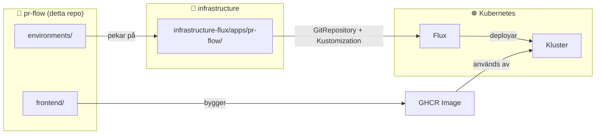
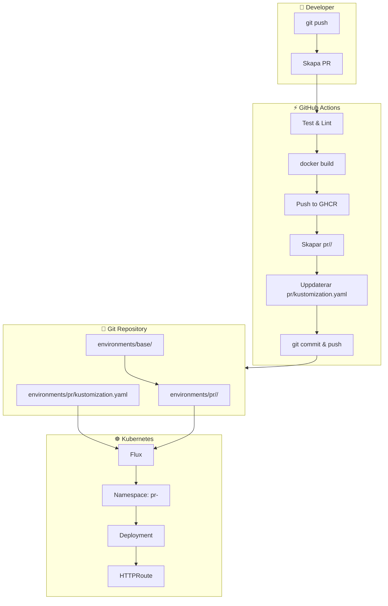
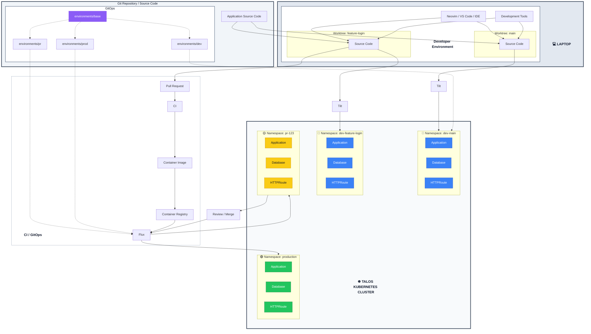

# Repository Template

Detta repo innehåller applikationskod och GitOps-manifest för pr-flow.

---

## Översikt



---

## Repositories

### pr-flow (detta repo)

Innehåller:
- **Applikationskod** i `frontend/`
- **GitOps-manifest** i `environments/`
- **CI/CD** i `.github/workflows/`

### infrastructure

Innehåller:
- **Flux-konfiguration** i `infrastructure-flux/apps/pr-flow/`
- **Kubernetes-komponenter** i `infrastructure-flux/components/`

---

## Mappstruktur

```
pr-flow/
├── .github/
│   └── workflows/
│       ├── ci-for-js-app.yaml        # Kör tester + bygger image
│       └── pr-preview.yaml            # Skapar PR preview overlays
│
├── frontend/                          # Applikationskod
│   └── Dockerfile                    # Byggs till GHCR image
│
└── environments/
    ├── base/                         # Gemensamma manifests (för alla miljöer)
    │   ├── kustomization.yaml
    │   ├── namespace.yaml
    │   ├── deployment.yaml
    │   ├── service.yaml
    │   └── httproute.yaml
    │
    ├── production/                   # Produktions-overlay
    │   ├── kustomization.yaml       # resources: [../base]
    │   └── namespace.yaml           # (unik: environment: production)
    │
    └── pr/                          # PR Preview overlays (dynamiska)
        ├── kustomization.yaml       # [./157, ./158, ...] ← uppdateras av CI
        └── <PR_NUM>/
            └── kustomization.yaml   # resources: [../../base] + patches
```

---

## Kustomize-arkitektur

```
┌─────────────────────────────────────────────────────────────┐
│                      environments/                          │
├─────────────────────────────────────────────────────────────┤
│                                                             │
│   ┌─────────────┐                                           │
│   │    base/    │  ← Gemensamma manifests                   │
│   │             │    (namespace, deployment, service, etc.) │
│   │  deployment │                                           │
│   │  service    │                                           │
│   │  httproute  │                                           │
│   └──────┬──────┘                                           │
│          │                                                   │
│          │  refereras av                                     │
│          ▼                                                   │
│   ┌─────────────────────────────────────────────────────┐  │
│   │                 Overlays                              │  │
│   ├─────────────────────────────────────────────────────┤  │
│   │                                                       │  │
│   │  production/        pr/157/        pr/158/           │  │
│   │  ├─ kustomize      ├─ kustomize    ├─ kustomize    │  │
│   │  └─ namespace      └─ patches       └─ patches       │  │
│   │                                                       │  │
│   └─────────────────────────────────────────────────────┘  │
│                                                             │
└─────────────────────────────────────────────────────────────┘
```

### Base (`environments/base/`)

Innehåller standardmanifest för appen. Används av alla miljöer.

### Production (`environments/production/`)

Produktions-specifika overrides:
```yaml
# environments/production/kustomization.yaml
resources:
  - ../base
```
```yaml
# environments/production/namespace.yaml (override)
apiVersion: v1
kind: Namespace
metadata:
  name: pr-flow
  labels:
    environment: production  # ← Unik för prod
```

### PR Previews (`environments/pr/<NUM>/`)

Dynamiskt skapade av GitHub Actions:
```yaml
# environments/pr/157/kustomization.yaml
resources:
  - ../../base

namespace: pr-157  # ← Unik per PR

patches:
  # Image-patch: använder PR-specifik image
  # Hostname-patch: pr-157.example.com
  # Labels: preview: "true"
```

---

## Hur Flux hittar manifesten

### I `infrastructure/infrastructure-flux/apps/pr-flow/`

```
infrastructure-flux/apps/pr-flow/
├── gitrepository.yaml        # ← Flux läser pr-flow repo
├── flux-kustomization.yaml  # ← Två Kustomizations
└── kustomization.yaml
```

```yaml
# gitrepository.yaml
apiVersion: source.toolkit.fluxcd.io/v1
kind: GitRepository
metadata:
  name: pr-flow
  namespace: flux-system
spec:
  url: ssh://git@github.com/simonbrundin/pr-flow
  ref:
    branch: main
```

```yaml
# flux-kustomization.yaml
---
# Produktion
apiVersion: kustomize.toolkit.fluxcd.io/v1
kind: Kustomization
metadata:
  name: pr-flow
spec:
  path: environments/production  # ← Läser pr-flow/environments/production
  sourceRef:
    kind: GitRepository
    name: pr-flow

---
# PR Previews
apiVersion: kustomize.toolkit.fluxcd.io/v1
kind: Kustomization
metadata:
  name: pr-flow-previews
spec:
  path: ./environments/pr       # ← Läser pr-flow/environments/pr
  sourceRef:
    kind: GitRepository
    name: pr-flow
  prune: true                  # Städar bort resurser vid borttagning
```

---

## CI/CD Flöde

### Pull Request



### Steg-för-steg

| Steg | Action | Var |
|------|--------|-----|
| 1 | Developer skapar PR | GitHub |
| 2 | GitHub Actions triggas | `.github/workflows/pr-preview.yaml` |
| 3 | Kör tester | CI |
| 4 | Bygger image | `frontend/Dockerfile` |
| 5 | Pushar till GHCR | Tag: `pr-<NUM>-<sha>` |
| 6 | Skapar `environments/pr/<NUM>/` | med base + patches |
| 7 | Uppdaterar `environments/pr/kustomization.yaml` | Lägger till `./<NUM>` |
| 8 | Commit & push | Till PR-branchen |
| 9 | Flux ser ändringarna | `infrastructure-flux/apps/pr-flow/` |
| 10 | Flux deployar | `pr-<NUM>` namespace |

### PR Stängning

| Steg | Action |
|------|--------|
| 1 | Developer stänger PR |
| 2 | GitHub Actions triggas |
| 3 | Tar bort `environments/pr/<NUM>/` |
| 4 | Uppdaterar `environments/pr/kustomization.yaml` |
| 5 | Flux tar bort resurser (prune: true) |

---

## GitOps-principen

```
┌─────────────────────────────────────────────────────────────┐
│                                                             │
│   GitHub Actions                   Flux                      │
│                                                             │
│   ┌───────────────┐              ┌───────────────┐         │
│   │  Bygger image │   push       │  Läser Git    │         │
│   │  Commit:ar    │ ──────────▶  │  Deployar     │         │
│   │  manifests    │              │  Kubernetes   │         │
│   └───────────────┘              └───────────────┘         │
│                                                             │
│   ÄNDRAR INTE KLASTRET DIREKT    LÄSER ENBART FRÅN GIT    │
│                                                             │
└─────────────────────────────────────────────────────────────┘
```

**Regler:**
1. GitHub Actions **aldrig** applicerar direkt till Kubernetes
2. Flux **aldrig** ändrar Git
3. Allt går via Git

---

## Miljöer

| Miljö | Källa | Styrning | URL |
|-------|-------|----------|-----|
| **production** | `environments/production/` | Flux | `prflow.example.com` |
| **preview** | `environments/pr/<NUM>/` | Flux + GitHub Actions | `pr-<NUM>.example.com` |
| **dev** | lokalt | Tilt | `localhost:3000` |

---

## Infrastructure-koppling

```
infrastructure/
└── infrastructure-flux/
    └── apps/
        └── pr-flow/                    # ← Konfiguration för denna app
            ├── gitrepository.yaml       # Läser pr-flow repo
            └── flux-kustomization.yaml  # Två Kustomizations:
                                         #   - pr-flow (production)
                                         #   - pr-flow-previews (PRs)
```

### Lägga till en ny app

1. Skapa mapp i `infrastructure-flux/apps/<app>/`
2. Lägg till `gitrepository.yaml`
3. Lägg till `flux-kustomization.yaml`
4. Uppdatera `infrastructure-flux/apps/kustomization.yaml`

---

## Preview URL

```
https://pr-<NUM>.example.com
```

**Förutsättningar:**
- `external-dns` konfigurerad i klustret
- Gateway `traefik-gateway` finns i `flux-system`
- DNS pekar mot klustret

---

## Architecture Overview



## Databasschema

```mermaid
erDiagram
    %!generate db diagram from schema.sql
```
