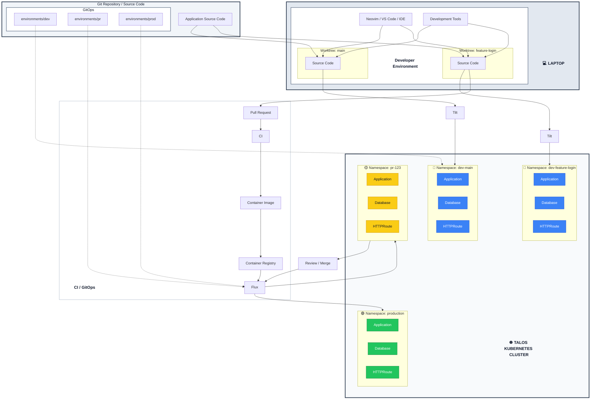

# Repository Template

Jag vill alltid att ett databas

## Miljöer

## Architecture Overview

```mermaid
flowchart TB
    subgraph REPO["Git Repository / Source Code"]
        APP_SOURCE["Application Source Code"]

        subgraph GITOPS["GitOps"]
            DEV_GITOPS["environments/dev"]
            PR_GITOPS["environments/pr"]
            PROD_GITOPS["environments/prod"]
        end
    end

    subgraph LAPTOP[" "]
        LAPTOP_TITLE["💻 LAPTOP"]

        subgraph DEVENV[" "]
            DEV_TITLE["Developer Environment"]

            IDE["Neovim / VS Code / IDE"]
            TOOLS["Development Tools"]

            subgraph WT1["Worktree: main"]
                WORKTREE1["Source Code"]
            end

            subgraph WT2["Worktree: feature-login"]
                WORKTREE2["Source Code"]
            end

            IDE --> WORKTREE1
            IDE --> WORKTREE2
            TOOLS --> WORKTREE1
            TOOLS --> WORKTREE2
        end
    end

    APP_SOURCE --> WORKTREE1
    APP_SOURCE --> WORKTREE2

    WORKTREE1 --> TILT1["Tilt"]
    WORKTREE2 --> TILT2["Tilt"]

    subgraph K8S[" "]
        K8S_TITLE["☸ TALOS KUBERNETES CLUSTER"]

        subgraph DEVROW[" "]
            subgraph DEV1["🔵 Namespace: dev-main"]
                APP1["Application"]
                DB1["Database"]
                ROUTE1["HTTPRoute"]
            end

            subgraph DEV2["🔵 Namespace: dev-feature-login"]
                APP2["Application"]
                DB2["Database"]
                ROUTE2["HTTPRoute"]
            end
        end

        subgraph DELIVERYROW[" "]
            subgraph PR["🟡 Namespace: pr-123"]
                PRAPP["Application"]
                PRDB["Database"]
                PRROUTE["HTTPRoute"]
            end

            subgraph PROD["🟢 Namespace: production"]
                PRODAPP["Application"]
                PRODDB["Database"]
                PRODROUTE["HTTPRoute"]
            end
        end
    end

    TILT1 --> DEV1
    TILT2 --> DEV2

    WORKTREE2 --> PRREQ["Pull Request"]

    subgraph DELIVERY[" "]
        DELIVERY_TITLE["CI / GitOps"]

        CI["CI"]
        IMAGE["Container Image"]
        REGISTRY["Container Registry"]
        FLUX["Flux"]

        PRREQ --> CI
        CI --> IMAGE
        IMAGE --> REGISTRY
    end

    DEV_GITOPS -.-> DEV1
    PR_GITOPS -.-> FLUX
    PROD_GITOPS -.-> FLUX

    REGISTRY --> FLUX
    FLUX --> PR
    PR --> REVIEW["Review / Merge"]
    REVIEW --> FLUX
    FLUX --> PROD

    classDef dev fill:#3b82f6,stroke:#1d4ed8,color:#ffffff
    classDef pr fill:#facc15,stroke:#ca8a04,color:#111827
    classDef prod fill:#22c55e,stroke:#15803d,color:#ffffff

    class APP1,DB1,ROUTE1,APP2,DB2,ROUTE2 dev
    class PRAPP,PRDB,PRROUTE pr
    class PRODAPP,PRODDB,PRODROUTE prod

    classDef title fill:none,stroke:none,color:#0f172a,font-size:18px,font-weight:bold
    class LAPTOP_TITLE,DEV_TITLE,K8S_TITLE,DELIVERY_TITLE title

    style REPO fill:#f1f5f9,stroke:#334155,stroke-width:3px,color:#0f172a
    style GITOPS fill:#ffffff,stroke:#64748b,stroke-width:2px,color:#0f172a
    style LAPTOP fill:#e2e8f0,stroke:#334155,stroke-width:3px
    style DEVENV fill:#ffffff,stroke:#64748b,stroke-width:2px
    style K8S fill:#f8fafc,stroke:#334155,stroke-width:3px
    style DELIVERY fill:#ffffff,stroke:#94a3b8
    style DEVROW fill:none,stroke:none
    style DELIVERYROW fill:none,stroke:none
```
